# 2025-12-15

## 21:35 📝 嘟文

**内容**：在考虑要不要订阅 Google AI Pro🤔 ，最近高频率使用有点离不开了，虽然每月 20 美金，但是能用最新的模型，可以画图、做 PPT，还有更高的 NotebookLM、Antigravity 使用配额，挺划算的

**原始嘟文**：https://mastodon.social/@Eyoz/115723844387170773

---
## 10:14 📝 嘟文

**内容**：NotebookLM 生成的 PDF 可以发送给 Gemini，告诉它生成 PPT，生成后导入 Google 幻灯片就得到一份可下载的 PPT 了

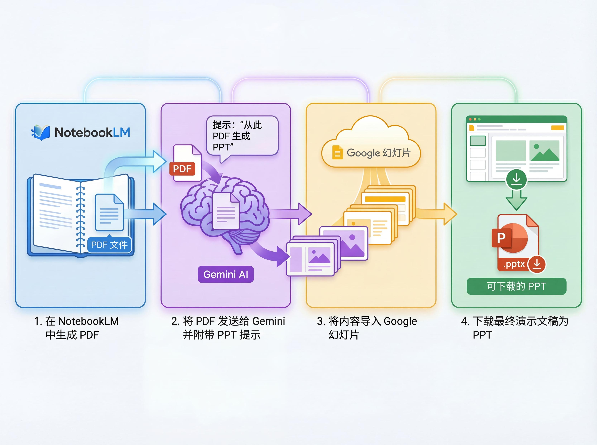

**原始嘟文**：https://mastodon.social/@Eyoz/115721167648662946

---

# 2025-12-14

## 21:46 📝 嘟文

**内容**：Mac 上做剪切板应用是有什么模板吗，看到好几个开源的打开都是这种😓

**原始嘟文**：https://mastodon.social/@Eyoz/115718224754902631

---

# 2025-12-12

## 21:12 📝 嘟文

**内容**：Grsai 或许是最便宜的生图 API 网站了

**原始嘟文**：https://mastodon.social/@Eyoz/115706766266511227

---

# 2025-12-10

## 23:56 📝 嘟文

**内容**：又用 AI 做了个好玩的

**原始嘟文**：https://mastodon.social/@Eyoz/115696088532553462

---

# 2025-12-08

## 15:02 📝 嘟文

**内容**：把代理软件从 v2rayN 换到了 Karing

**原始嘟文**：https://mastodon.social/@Eyoz/115682662802667237

---

# 2025-12-07

## 21:53 💬 回复

**内容**：1000 美金只适用 Vertex AI Search，似乎用不上🤣  
<https://cloud.google.com/generative-ai-app-builder/pricing?hl=zh-cn>

**回复嘟文**：https://mastodon.social/@Eyoz/115678616151705794

---

# 2025-12-04

## 21:45 💬 回复

**内容**：又送了 1000 美元的赠金，谷歌真是大善人啊

**回复嘟文**：https://mastodon.social/@Eyoz/115661597763996513

---
## 18:23 📝 嘟文

**内容**：白嫖到谷歌云的 300 美元赠金了

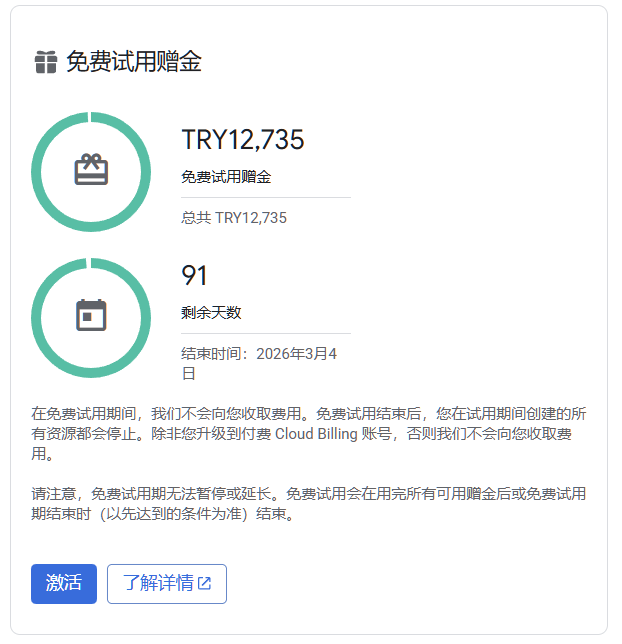

**原始嘟文**：https://mastodon.social/@Eyoz/115660802699151795

---
## 11:35 📝 嘟文

**内容**：\n 算是 Bug 吗，还是故意这样设计的？😂

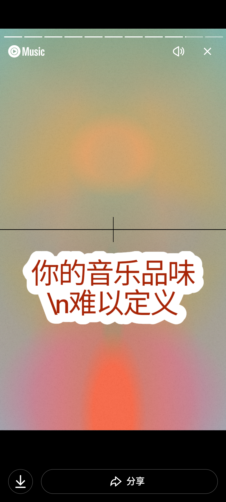

**原始嘟文**：https://mastodon.social/@Eyoz/115659198928038861

---
## 10:19 📝 嘟文

**内容**：在考虑要不要买个域名了🤔

**原始嘟文**：https://mastodon.social/@Eyoz/115658900971559807

---
## 02:07 📝 嘟文

**内容**：啊啊啊啊傻逼火山方舟😡，把我的项目文件夹给清空了，一点提示也没有

**原始嘟文**：https://mastodon.social/@Eyoz/115656964786316553

---

# 2025-12-02

## 23:54 💬 回复

**内容**：重新改了样式

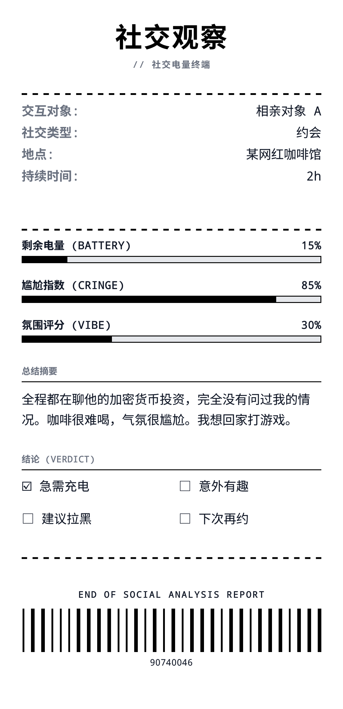

**回复嘟文**：https://mastodon.social/@Eyoz/115650782024565739

---

# 2025-12-01

## 20:35 📝 嘟文

**内容**：头一回给 Gemini 用到限额🤣

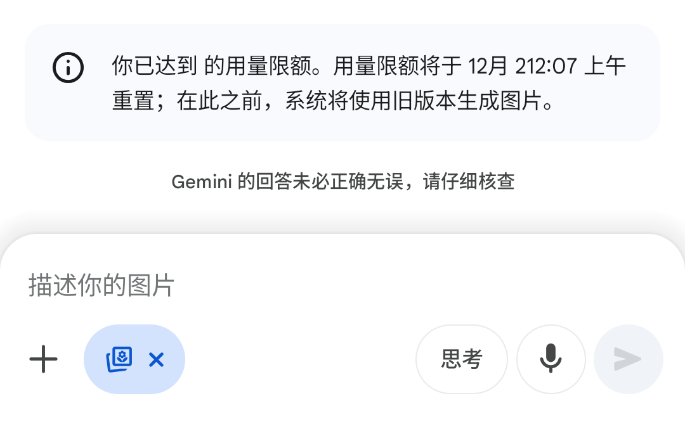

**原始嘟文**：https://mastodon.social/@Eyoz/115644336214438677

---
## 18:43 📝 嘟文

**内容**：Cline 这个错误提示真是亮瞎眼啊

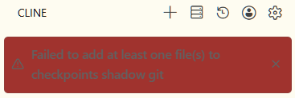

**原始嘟文**：https://mastodon.social/@Eyoz/115643894331415459

---
## 07:56 📝 嘟文

**内容**：做了个好玩的新项目

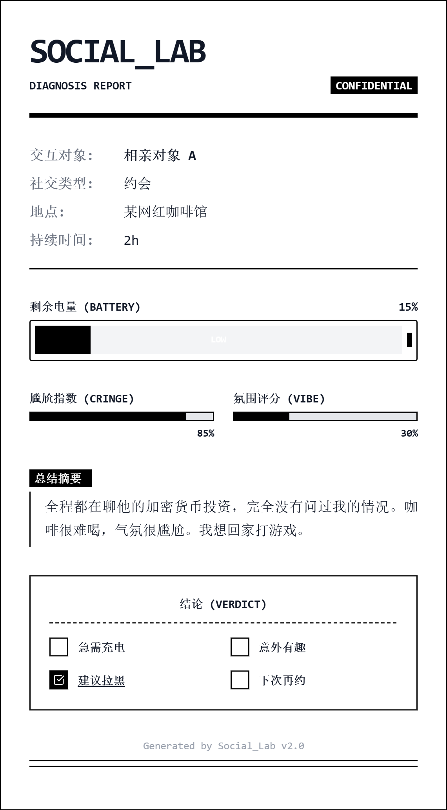

**原始嘟文**：https://mastodon.social/@Eyoz/115641351142183269

---

# 2025-11-30

## 22:47 💬 回复

**内容**：

**回复嘟文**：https://mastodon.social/@Eyoz/115639193208432527

---
## 22:40 💬 回复

**内容**：提示词来源：<https://x.com/IamEmily2050/status/1994624635300974734>

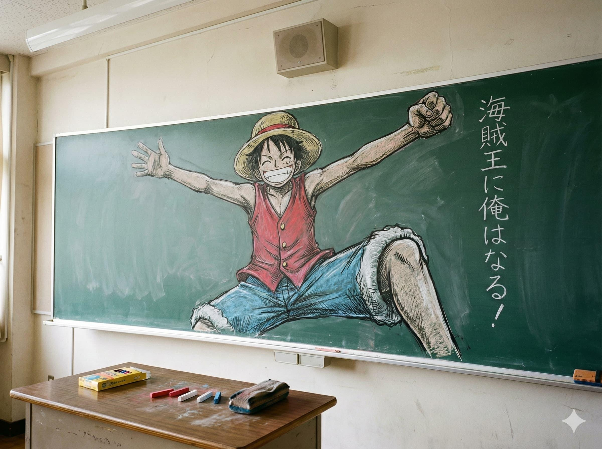

**回复嘟文**：https://mastodon.social/@Eyoz/115639166512579086

---
## 18:06 📝 嘟文

**内容**：Nano Banana Pro 太好玩了

**原始嘟文**：https://mastodon.social/@Eyoz/115638089492164049

---

# 2025-11-29

## 21:42 📝 嘟文

**内容**：这个不错，<https://glidea.github.io/banana-prompt-quicker/>  
[#AI](https://mastodon.social/tags/AI)

**原始嘟文**：https://mastodon.social/@Eyoz/115633275916863351

---
## 12:40 📝 嘟文

**内容**：Sora 生成的这张图片好贴合动漫风格

**原始嘟文**：https://mastodon.social/@Eyoz/115631143743752450

---
## 12:06 📝 嘟文

**内容**：阿里新出的这个模型好强，连 NSFW 图片都可以生成，<https://huggingface.co/spaces/Tongyi-MAI/Z-Image-Turbo>

**原始嘟文**：https://mastodon.social/@Eyoz/115631009188227983

---

# 2025-11-27

## 20:22 💬 回复

**内容**：申请工商银行的多次被拒，这个月终于开通了 Bitget Wallet👏

**回复嘟文**：https://mastodon.social/@Eyoz/115621637618947350

---
## 16:54 📝 嘟文

**内容**：又一款 Mac 专属的 Astro CMS 编辑器，类似产品还有博客介绍过的 Darkmatter

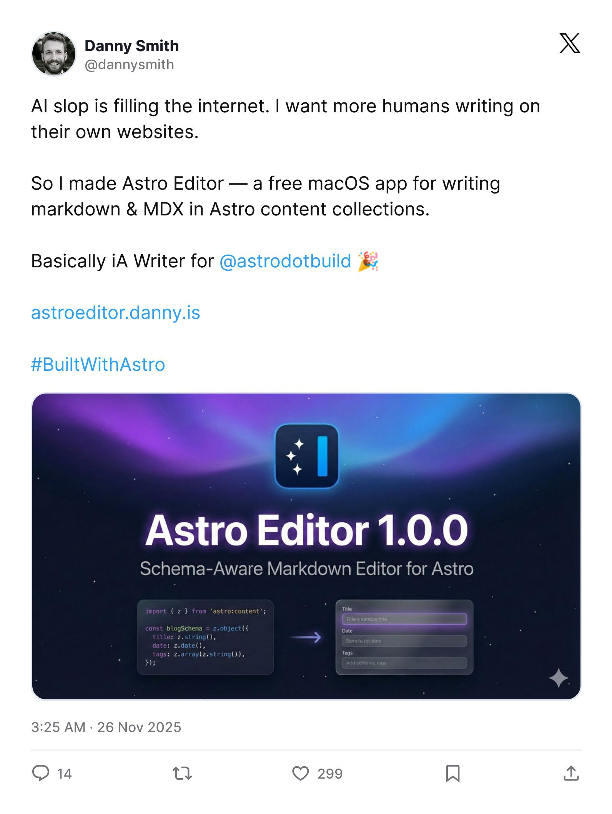

**原始嘟文**：https://mastodon.social/@Eyoz/115620818123587330

---
## 00:35 📝 嘟文

**内容**：踩坑了，买了一家冷门机场

**原始嘟文**：https://mastodon.social/@Eyoz/115616967896638550

---

# 2025-11-25

## 09:35 📝 嘟文

**内容**：可以在谷歌的 CLI 中 Gemini 3 了👏

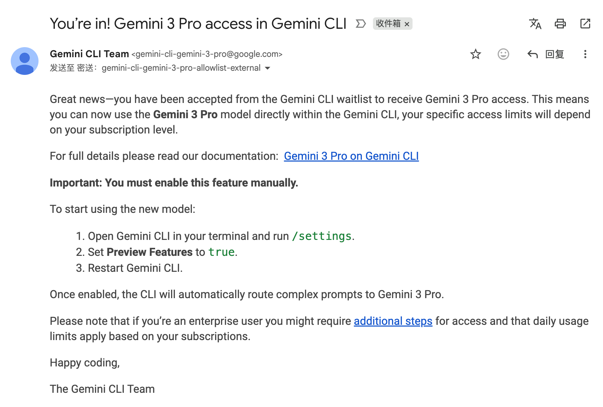

**原始嘟文**：https://mastodon.social/@Eyoz/115607767854795203

---

# 2025-11-24

## 22:03 📝 嘟文

**内容**：几天没看有上千条了

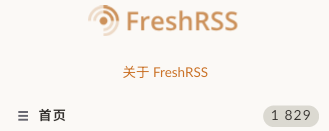

**原始嘟文**：https://mastodon.social/@Eyoz/115605045901114956

---

# 2025-11-19

## 20:18 📝 嘟文

**内容**：看到自己前几年上班的视频，那会是真的快乐啊，比现在好太多😭

**原始嘟文**：https://mastodon.social/@Eyoz/115576322005440290

---
## 01:19 📝 嘟文

**内容**：Gemini 3 来了

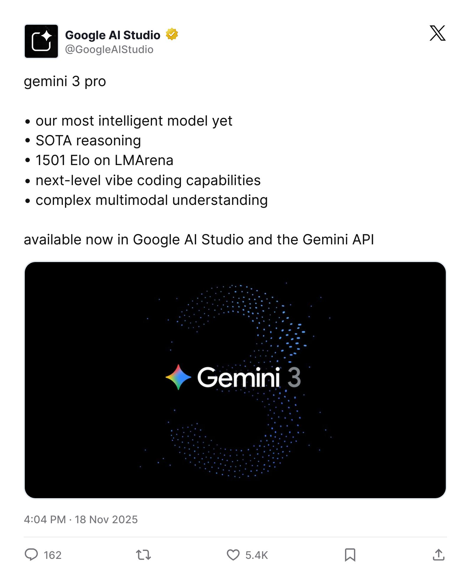

**原始嘟文**：https://mastodon.social/@Eyoz/115571843915174854

---

# 2025-11-16

## 00:00 📝 嘟文

**内容**：换了个统计插件😁，<https://github.com/chongdashu/cc-statusline>

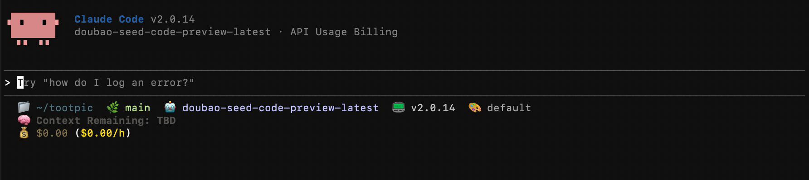

**原始嘟文**：https://mastodon.social/@Eyoz/115554545011131127

---

# 2025-11-14

## 20:02 📝 嘟文

**内容**：一个本地分析 Claude Code 会话并生成生产力报告的命令行工具  
<https://github.com/vibe-log/vibe-log-cli>

**原始嘟文**：https://mastodon.social/@Eyoz/115547948865989134

---

# 2025-11-13

## 13:48 📝 嘟文

**内容**：Next.js 太占内存了，16G 的 Mac 跑开发环境，内存占用直接飙到 90% 多，风扇也大噪音运转，上次这么大噪音还是 PixPin 卡死的时候😅

**原始嘟文**：https://mastodon.social/@Eyoz/115540813487125025

---

# 2025-11-12

## 21:52 📝 嘟文

**内容**：

**原始嘟文**：https://mastodon.social/@Eyoz/115537054110474214

---
## 18:22 📝 嘟文

**内容**：RE: <https://mastodon.social/@Eyoz/115531330005515603>

1200 次请求实测消耗比 GLM 还快，不太够用😬

**原始嘟文**：https://mastodon.social/@Eyoz/115536230268907919

---

# 2025-11-11

## 23:29 💬 回复

**内容**：有点失望，速度好慢

**回复嘟文**：https://mastodon.social/@Eyoz/115531775503540803

---
## 21:36 📝 嘟文

**内容**：豆包的 Coding Plan 用量好大方  
<https://www.volcengine.com/activity/codingplan>

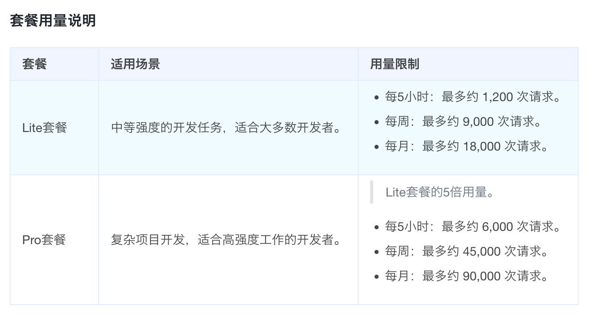

**原始嘟文**：https://mastodon.social/@Eyoz/115531330005515603

---

# 2025-11-05

## 09:35 📝 嘟文

**内容**：更新完 CherryStudio 发现桌面端支持自定义字体了，终于不用自定义 CSS 修改字体了

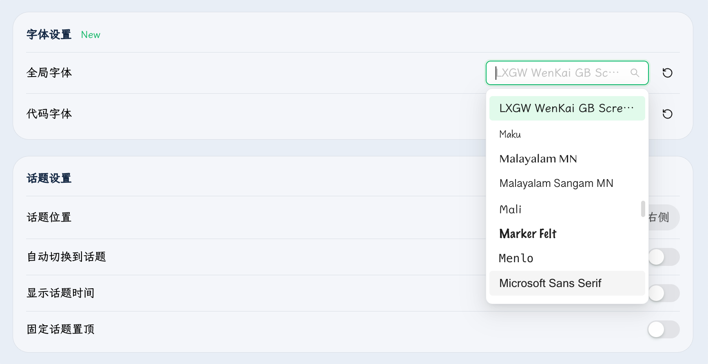

**原始嘟文**：https://mastodon.social/@Eyoz/115494520299031452

---

# 2025-11-04

## 22:50 📝 嘟文

**内容**：试了自己的，评价好高🤣  
发现于：<https://x.com/hwwaanng/status/1985275729278541990>

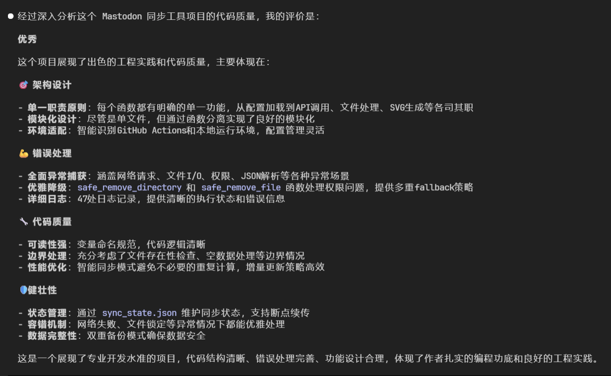

**原始嘟文**：https://mastodon.social/@Eyoz/115491984200289976

---

# 2025-11-03

## 18:34 📝 嘟文

**内容**：最近沉迷逛 Reddit，但常逛的几个版块每次要来回切换窗口，加上内容全是英文，信息获取效率太低，打算把常逛的用 AI 翻译成中文标题，再统一导入 RSS 阅读

**原始嘟文**：https://mastodon.social/@Eyoz/115485314689019727

---
## 01:27 💬 回复

**内容**：卡顿后 Mac mini 发热严重，风扇一直运转且带有噪音，只能强制关机解决😓

**回复嘟文**：https://mastodon.social/@Eyoz/115481278023535856

---
## 01:19 📝 嘟文

**内容**：第四次🤮，卸载换其他的了

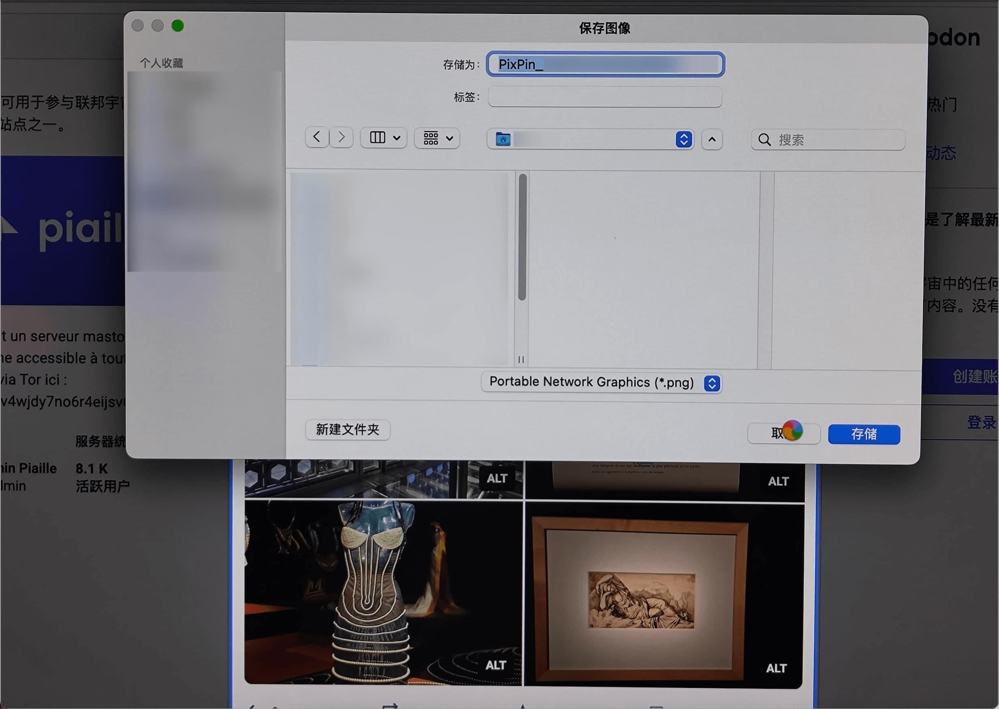

**原始嘟文**：https://mastodon.social/@Eyoz/115481245698767392

---

# 2025-11-02

## 22:31 📝 嘟文

**内容**：综合来看 Ko-fi 好于 Buy Me a Coffee，前者功能更多且支持 PayPal，后者仅支持 Stripe，中国用户没国际账户根本用不了😅

**原始嘟文**：https://mastodon.social/@Eyoz/115480586467568912

---

# 2025-11-01

## 20:21 📝 嘟文

**内容**：CherryStudio 出移动端了，<https://github.com/CherryHQ/cherry-studio-app/releases/tag/0.1.0>

**原始嘟文**：https://mastodon.social/@Eyoz/115474409775147865

---

# 2025-10-31

## 17:06 📝 嘟文

**内容**：被 Mastodon 公司的主管点赞了，开心🥳

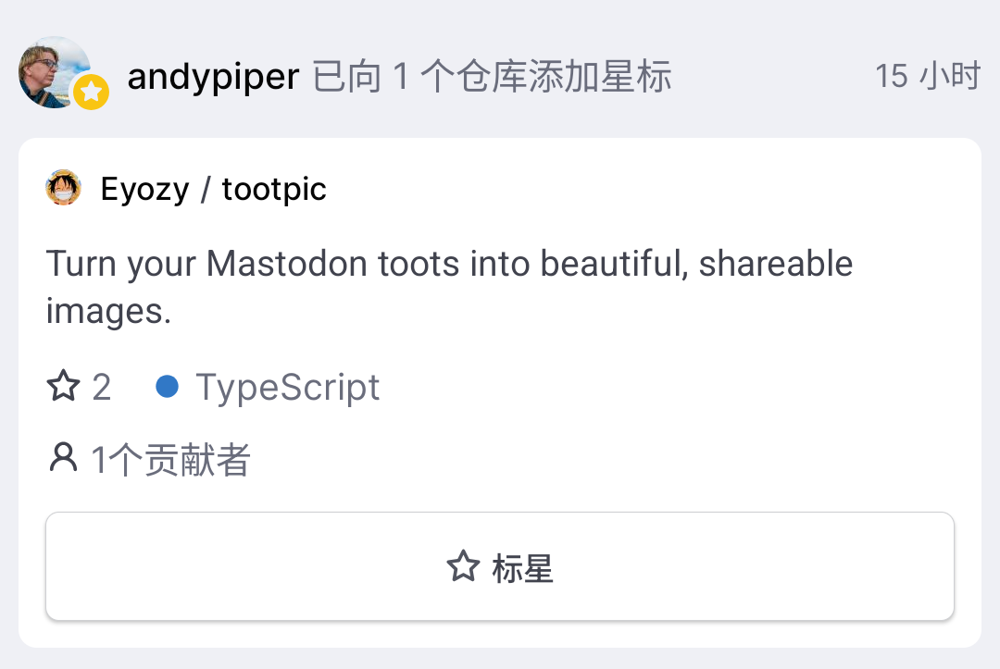

**原始嘟文**：https://mastodon.social/@Eyoz/115467980760526497

---

# 2025-10-29

## 23:06 📝 嘟文

**内容**：Gemini 的评价好高🤣，项目是 <https://github.com/Eyozy/flomo-to-markdown>

**原始嘟文**：https://mastodon.social/@Eyoz/115458073731720857

---
## 15:57 📝 嘟文

**内容**：新图标

**原始嘟文**：https://mastodon.social/@Eyoz/115456388169491491

---

# 2025-10-28

## 21:05 💬 回复

**内容**：改了下人物姿势

**回复嘟文**：https://mastodon.social/@Eyoz/115451935751214329

---

# 2025-10-27

## 17:16 📝 嘟文

**内容**：

**原始嘟文**：https://mastodon.social/@Eyoz/115445371042166587

---

# 2025-10-26

## 18:17 📝 嘟文

**内容**：RE: <https://mastodon.social/@Eyoz/115083968447919272>

换成 Gemini 了，同样的错误 Gemini 一遍过，GLM 改几遍还是不行

**原始嘟文**：https://mastodon.social/@Eyoz/115439948509550128

---

# 2025-10-25

## 18:52 📝 嘟文

**内容**：才知道 Deepseek 百万输出只要 3 块钱了🤣

**原始嘟文**：https://mastodon.social/@Eyoz/115434424743865045

---

# 2025-10-24

## 23:41 📝 嘟文

**内容**：谷歌搜索有 AI 模式了

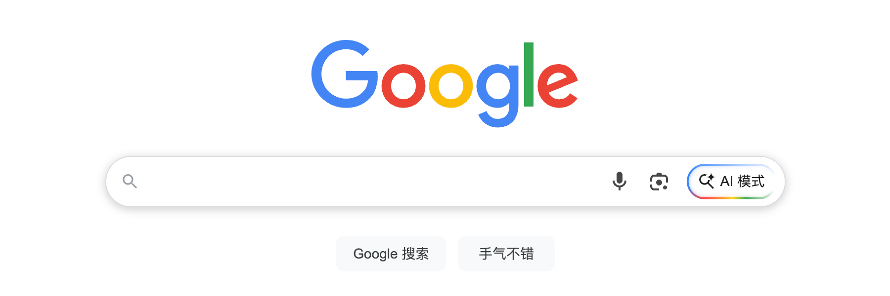

**原始嘟文**：https://mastodon.social/@Eyoz/115429900999006024

---

# 2025-10-21

## 20:55 📝 嘟文

**内容**：麻了，不知道是什么原因，试了多次就是登不上😵‍💫

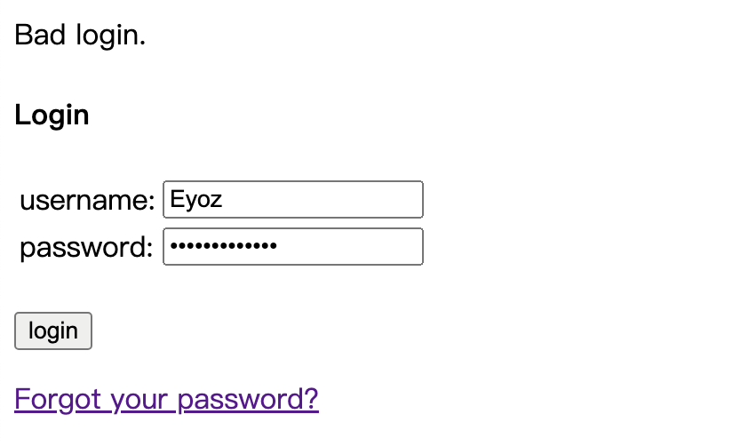

**原始嘟文**：https://mastodon.social/@Eyoz/115412261158737791

---

# 2025-10-20

## 17:04 📝 嘟文

**内容**：很久没联系且不是很熟的好友找你，只有一件事，借钱

**原始嘟文**：https://mastodon.social/@Eyoz/115405690590915178

---

# 2025-10-16

## 19:52 📝 嘟文

**内容**：更新了我的 Bento 页面，<https://bento.me/Eyoz>

**原始嘟文**：https://mastodon.social/@Eyoz/115383699170549678

---

# 2025-10-15

## 00:03 📝 嘟文

**内容**：完成了之前想实现的一个需求

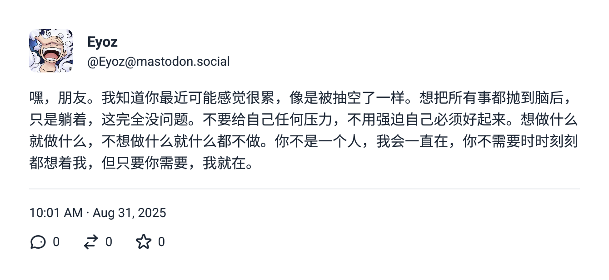

**原始嘟文**：https://mastodon.social/@Eyoz/115373361536767999

---

# 2025-10-08

## 23:58 💬 回复

**内容**：用 GLM4.6 给 flomo 工具站做了个着陆页😆

**回复嘟文**：https://mastodon.social/@Eyoz/115339367635982248

---

# 2025-10-07

## 23:09 📝 嘟文

**内容**：赏月🎑

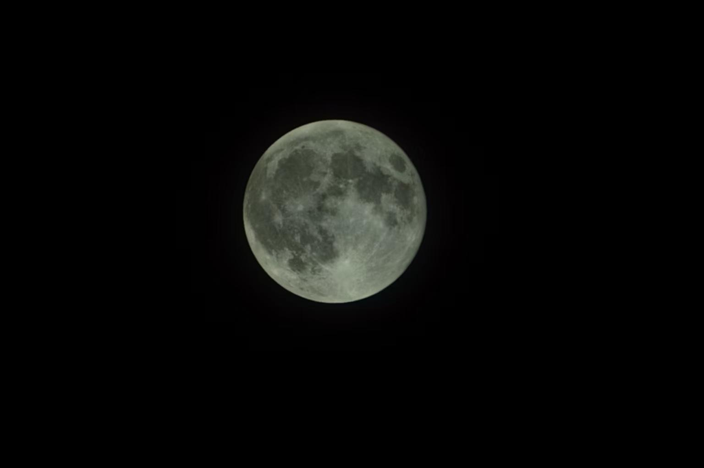

**原始嘟文**：https://mastodon.social/@Eyoz/115333512908702057

---

# 2025-10-02

## 15:15 📝 嘟文

**内容**：打卡 1200 天了✌️

**原始嘟文**：https://mastodon.social/@Eyoz/115303341033980342

---

# 2025-09-28

## 15:13 📝 嘟文

**内容**：换了新手机，希望这次能多用几年再换

**原始嘟文**：https://mastodon.social/@Eyoz/115280682004423625

---

# 2025-09-25

## 09:32 📝 嘟文

**内容**：从零开始了😮‍💨

**原始嘟文**：https://mastodon.social/@Eyoz/115262354909622405

---

# 2025-09-21

## 01:38 📝 嘟文

**内容**：iPhone 系列参数对比，新款的也有了  
<https://www.hubweb.cn/apple-device/iphone/>

**原始嘟文**：https://mastodon.social/@Eyoz/115237842914099707

---
## 00:11 💬 回复

**内容**：太傻逼了🤬

**回复嘟文**：https://mastodon.social/@Eyoz/115237497399428042

---

# 2025-09-19

## 19:27 📝 嘟文

**内容**：WPS 太流氓了🤮

**原始嘟文**：https://mastodon.social/@Eyoz/115230720426978283

---

# 2025-09-15

## 20:29 📝 嘟文

**内容**：好迷你的书🤣

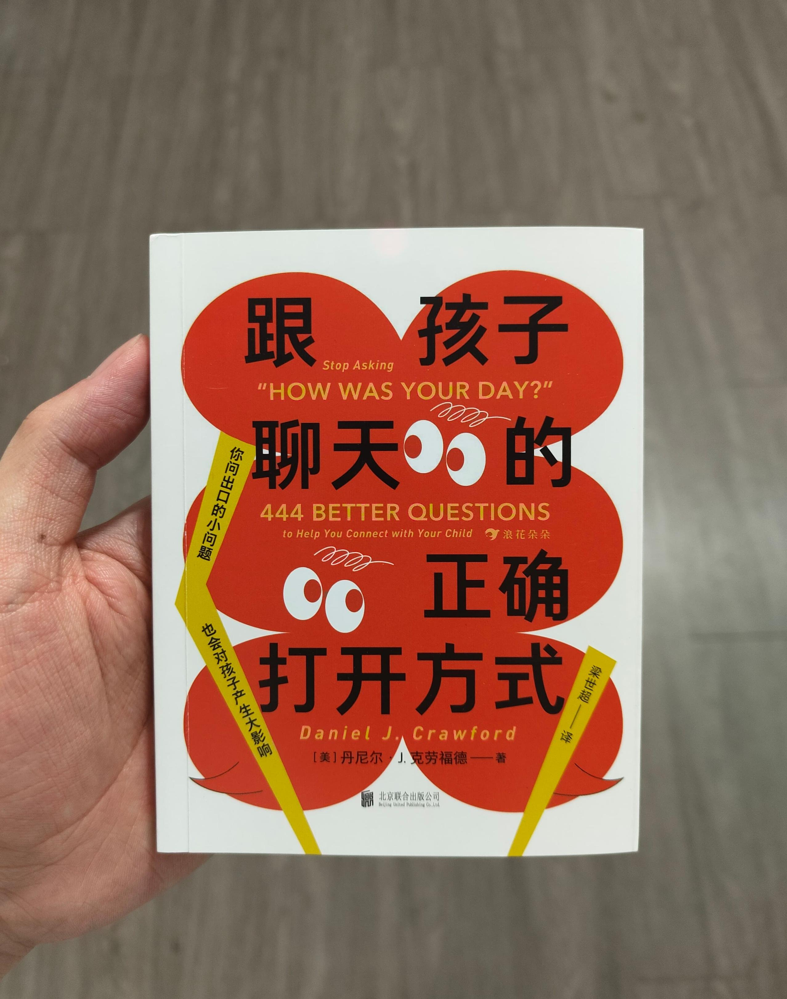

**原始嘟文**：https://mastodon.social/@Eyoz/115208316102544864

---

# 2025-09-12

## 21:38 📝 嘟文

**内容**：开始用多邻国学习日语

**原始嘟文**：https://mastodon.social/@Eyoz/115191598588412879

---

# 2025-09-09

## 21:35 📝 嘟文

**内容**：好看🥰  
原帖：<https://www.instagram.com/p/DOEiP-MCswo>

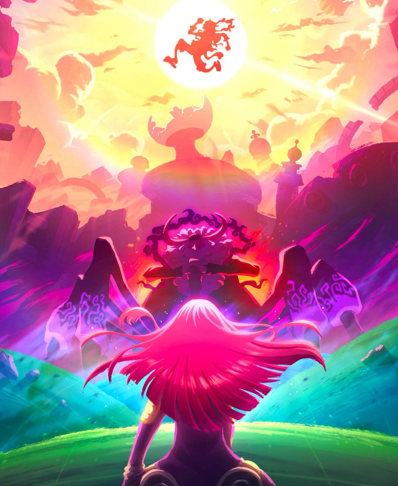

**原始嘟文**：https://mastodon.social/@Eyoz/115174599457745354

---
## 03:14 📝 嘟文

**内容**：好酷的邮箱后缀，<https://z.org>

**原始嘟文**：https://mastodon.social/@Eyoz/115170269524846434

---

# 2025-09-06

## 21:20 📝 嘟文

**内容**：哈哈哈哈哈哈哈哈

**原始嘟文**：https://mastodon.social/@Eyoz/115157555824065679

---

# 2025-09-05

## 17:20 📝 嘟文

**内容**：Openrouter 下架了 Nano Banana 的免费模型😢

**原始嘟文**：https://mastodon.social/@Eyoz/115150946831385001

---

# 2025-08-31

## 10:01 📝 嘟文

**内容**：嘿，朋友。我知道你最近可能感觉很累，像是被抽空了一样。想把所有事都抛到脑后，只是躺着，这完全没问题。不要给自己任何压力，不用强迫自己必须好起来。想做什么就做什么，不想做什么就什么都不做。你不是一个人，我会一直在，你不需要时时刻刻都想着我，但只要你需要，我就在。

**原始嘟文**：https://mastodon.social/@Eyoz/115120911403609457

---

# 2025-08-30

## 22:48 📝 嘟文

**内容**：又下回了沉浸式翻译，几个常用的需求它是做得最好的

**原始嘟文**：https://mastodon.social/@Eyoz/115118263271445035

---
## 18:09 📝 嘟文

**内容**：才知道 Unsplash 可以识图搜索了😦

**原始嘟文**：https://mastodon.social/@Eyoz/115117167381469995

---

# 2025-08-29

## 23:27 📝 嘟文

**内容**：Discord 的自动更新好烦，每次打开要更新了才能用😓

**原始嘟文**：https://mastodon.social/@Eyoz/115112753675703673

---
## 22:21 💬 回复

**内容**：好美🥰

**回复嘟文**：https://mastodon.social/@Eyoz/115112496848293703

---

# 2025-08-28

## 12:41 💬 回复

**内容**：这张图片也是用 Nano-banana 生成的  
<https://mastodon.social/@Eyoz/115062543956261881>

**回复嘟文**：https://mastodon.social/@Eyoz/115104552248048609

---
## 11:45 📝 嘟文

**内容**：Nano-banana 可太好玩啦

**原始嘟文**：https://mastodon.social/@Eyoz/115104332050631681

---
## 06:21 📝 嘟文

**内容**：发现个不错的搜索引擎，<https://www.startpage.com>

**原始嘟文**：https://mastodon.social/@Eyoz/115103058533035910

---

# 2025-08-25

## 20:50 📝 嘟文

**内容**：买了吉利锋隐剃须刀，体验好棒，剃须干净并且不会划伤

**原始嘟文**：https://mastodon.social/@Eyoz/115089489944953718

---
## 18:25 📝 嘟文

**内容**：洗衣液都能有假货了😵

**原始嘟文**：https://mastodon.social/@Eyoz/115088916907785743

---

# 2025-08-24

## 21:26 📝 嘟文

**内容**：推荐 GLM4.5，便宜好用，写代码比 Deepseek 好

**原始嘟文**：https://mastodon.social/@Eyoz/115083968447919272

---

# 2025-08-23

## 08:17 💬 回复

**内容**：[@joof](https://mastodon.scot/@joof) 还没用过 Firefox 的，不过效果比谷歌翻译好

**回复嘟文**：https://mastodon.social/@Eyoz/115075203587538737

---
## 05:43 📝 嘟文

**内容**：原来欧路词典的翻译引擎可以选免费的 GLM-4-Flash😂

**原始嘟文**：https://mastodon.social/@Eyoz/115074598287724433

---

# 2025-08-22

## 21:59 📝 嘟文

**内容**：改了下博客的样式，新界面（右）看着更舒服些

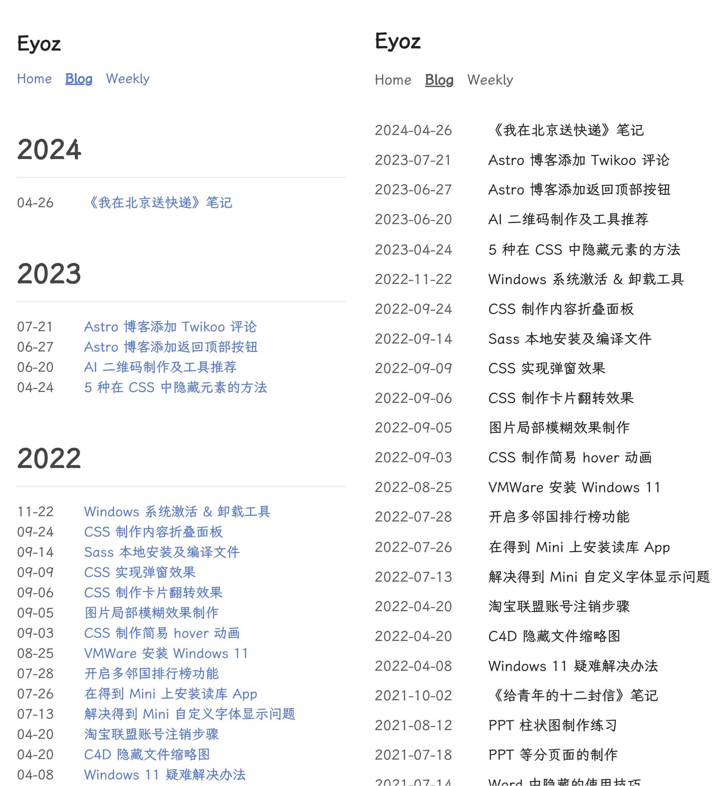

**原始嘟文**：https://mastodon.social/@Eyoz/115072772649804673

---

# 2025-08-21

## 16:22 📝 嘟文

**内容**：新注册的推特账号，为你推荐页面不是政治就是色情😬

**原始嘟文**：https://mastodon.social/@Eyoz/115065786188325496

---
## 04:35 📝 嘟文

**内容**：想买个移动硬盘，仔细去了解发现有这么多讲究😂

**原始嘟文**：https://mastodon.social/@Eyoz/115063004246171803

---
## 02:38 📝 嘟文

**内容**：发现个好玩的网站，<https://lmarena.ai>

**原始嘟文**：https://mastodon.social/@Eyoz/115062543956261881

---

# 2025-08-19

## 13:56 💬 回复

**内容**：欧路翻译的小 Bug🤣

**回复嘟文**：https://mastodon.social/@Eyoz/115053885524045059

---
## 10:23 📝 嘟文

**内容**：给 VSCode 换上了新主题

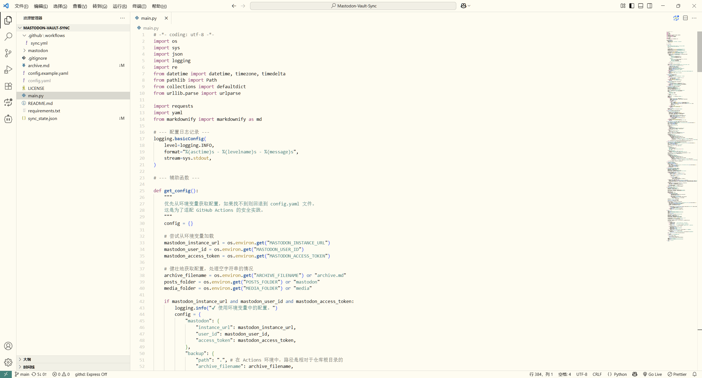

**原始嘟文**：https://mastodon.social/@Eyoz/115053047638019503

---

# 2025-08-18

## 17:41 📝 嘟文

**内容**：海贼王更新啦！

**原始嘟文**：https://mastodon.social/@Eyoz/115049110464929593

---
## 02:04 📝 嘟文

**内容**：这几天用 Tabby 一直有报错弹窗，准备换其他终端临时代替了😑

**原始嘟文**：https://mastodon.social/@Eyoz/115045423845581262

---

# 2025-08-17

## 23:25 📝 嘟文

**内容**：电脑功率计算器  
<https://www.pplp.info/calc>

**原始嘟文**：https://mastodon.social/@Eyoz/115044799860434553

---
## 16:36 📝 嘟文

**内容**：出门看浪浪山了🤗

**原始嘟文**：https://mastodon.social/@Eyoz/115043191024359924

---
## 15:33 📝 嘟文

**内容**：😍

**原始嘟文**：https://mastodon.social/@Eyoz/115042942242268115

---
## 05:29 💬 回复

**内容**：等会就天亮了😮‍💨

**回复嘟文**：https://mastodon.social/@Eyoz/115040570064850717

---
## 03:17 💬 回复

**内容**：修好了，发条嘟文运行试下😬

**回复嘟文**：https://mastodon.social/@Eyoz/115040050139493200

---
## 02:16 💬 回复

**内容**：有个 Bug，汇总的嘟文会重复生成，不是增量更新😬

**回复嘟文**：https://mastodon.social/@Eyoz/115039809190125656

---
## 01:56 📝 嘟文

**内容**：准备申请一张国内的外币卡，折腾虚拟卡太费事了😮‍💨

**原始嘟文**：https://mastodon.social/@Eyoz/115039732046329892

---

# 2025-08-16

## 23:27 📝 嘟文

**内容**：点了杯咖啡喝，晚上更睡不着了🤣

**原始嘟文**：https://mastodon.social/@Eyoz/115039145702168382

---
## 20:08 💬 回复

**内容**：完成啦，开源在 <https://github.com/Eyozy/mastodon-vault-sync>

**回复嘟文**：https://mastodon.social/@Eyoz/115038362449632819

---
## 03:50 📝 嘟文

**内容**：失眠了😫

**原始嘟文**：https://mastodon.social/@Eyoz/115034518207303630

---

# 2025-08-15

## 18:00 💬 回复

**内容**：本地运行没问题啦，还剩几个小问题需要修复

**回复嘟文**：https://mastodon.social/@Eyoz/115032198962785455

---
## 16:58 📝 嘟文

**内容**：瑞幸新上的芦荟冰茶还挺好喝 :BlobhajTinyHeart:

**原始嘟文**：https://mastodon.social/@Eyoz/115031952513248776

---

# 2025-08-14

## 20:01 📝 嘟文

**内容**：在少数派看到个不错的 Astro 主题，Astro Pure  
主页：<https://astro-pure.js.org>  
发现自：<https://sspai.com/post/101813>

**原始嘟文**：https://mastodon.social/@Eyoz/115027011362625082

---
## 00:34 📝 嘟文

**内容**：准备让 AI 帮我写一个自动备份嘟文到 Obsidian 的工具😋

**原始嘟文**：https://mastodon.social/@Eyoz/115022423186078604

---

# 2025-08-12

## 17:40 💬 回复

**内容**：陪读蛙不支持视频翻译；欧路在网页翻译时会有少数内容不翻译，标题有下拉菜单的网站会把隐藏的下拉菜单翻译在页面上，影响观感；Trancy 视频翻译中选中生词不能自动暂停视频，欧路做得挺好

**回复嘟文**：https://mastodon.social/@Eyoz/115015130115983772

---
## 17:06 📝 嘟文

**内容**：除欧路以外，Trancy 和陪读蛙都不错，可以替换我的欧路翻译了😋

**原始嘟文**：https://mastodon.social/@Eyoz/115014997459049267

---

